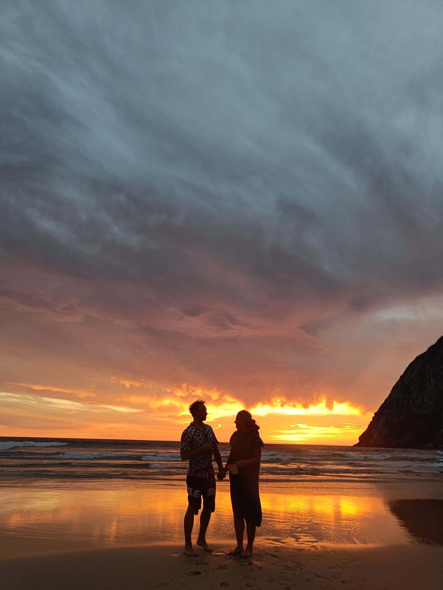

  

# **Wedding information**
Welcome to the wedding information page. This page contains facts and guides for the wedding and will be updated over the next year. 

### **Date and Location**
- The Wedding will take place on 2 August 2025 in Bodø in northern Norway. You can find it on google maps: <a href="https://maps.app.goo.gl/g4zBsFW85n4vBDAp6"> here</a>.

## **Travel information page**
We have provided a short travel information page: [go to travel-info](/travel-info)

## **Plan**

### **Friday 1 August**
- Sauna at [Fauna Bodø](https://www.nnbadstuforening.no/fauna-sauna) and dip in the ocean, bring beer, from 5pm to 7pm.
- Icebreaker drinks with cheese and wine, information coming, from 7.30pm onwards.

### **Saturday 2 August**
- Wedding @ [Bodin Kirke](the-day/index.md) at 1.30pm
- Champagne reception and mingling 2:30pm to 4pm
- [Dinner (Wedding Breakfast)](the-dinner/index.md) next to the church at 4pm
- Light food, refreshment and drinks at stabburet (the reception house) for those not coming to the dinner from 4pm
- [Reception](the-day/index.md#reception) to start from 7.30pm
- Reception party to end @ approx 4am on 3 August

## **FAQ**
- Q: Will there be space for kids?
- A: Young children (babs to todlers) yes. The venue has four locations. The dinner house, the reception house, the fancy house, and the party barn. The fancy house will be quieter, and have facilities for young children. They can be housed in prams / on laps for the dinner (that is up to you). Due to limited space at dinner, we can't offer seats to children for the wedding meal. Of course they are welcome everywhere else, including at the party if they wish to trip the light fantastic. 

- Q: What will the weather be like?
- A: We are not sure yet, please take a look in the travel-info section where we try to give some idea [here](/wedding/).

- Q: Will there be any Northern Lights?
- A: In August it is extremely unlikely due to the almost constant daylight.

- Q: Why is the ~~groom~~ best man so unreasonably handsome?
- ~~A: Awwww stop it, you're making me blush.~~
- A: He says it's a matter of who you're standing next to.

Please ask if you have questions. 

_Last updated: 17 June 2025_
